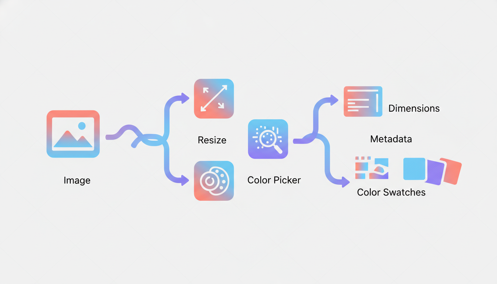
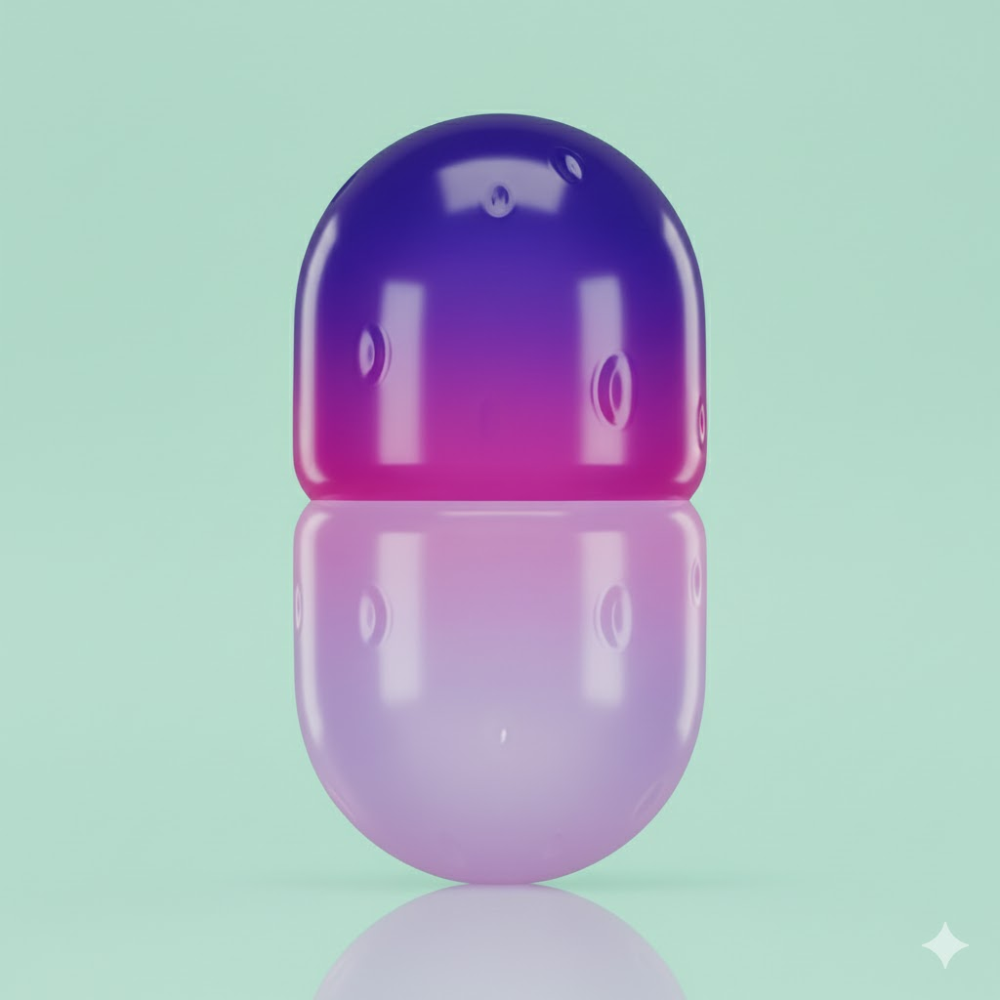
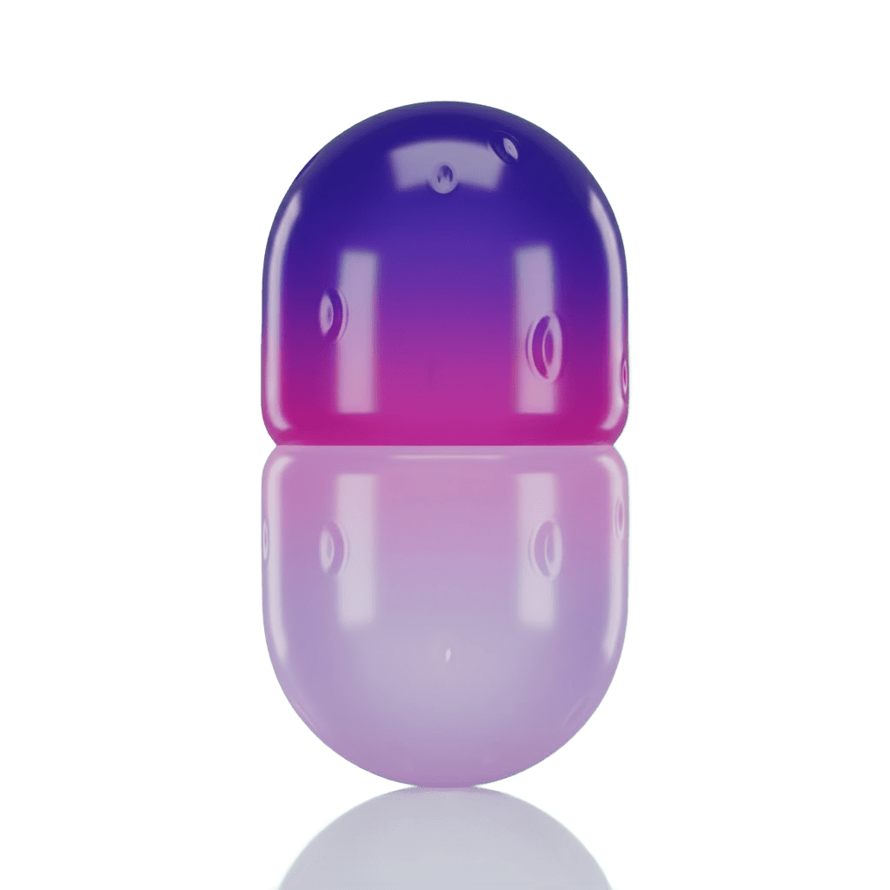
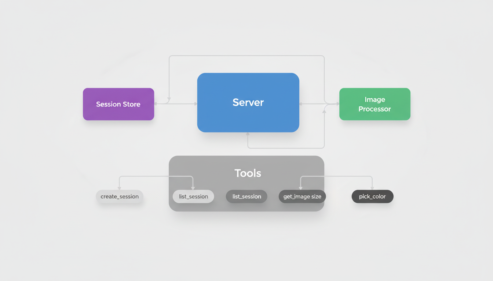

# Sharp MCP


[](https://www.npmjs.com/package/sharp-mcp)
[](https://opensource.org/licenses/MIT)
[](https://nodejs.org/)
[](https://www.typescriptlang.org/)

MCP (Model Context Protocol) server for image session management and processing. Provides tools for storing images in sessions and extracting image metadata and colors.

## Features



- **create_session**: Store base64 images in memory sessions with unique IDs
- **create_session_by_path**: Create sessions from image file paths (auto base64 conversion)
- **list_session**: List all active image sessions
- **get_dimensions**: Get image dimensions and MIME type
- **pick_color**: Extract average color from a specified region
- **remove_background**: Remove background from images using ML-based segmentation
- **extract_region**: Crop a rectangular region from an image
- **compress_image**: Compress images with format conversion (JPEG, PNG, WebP)
- Built with TypeScript for type safety
- Uses [sharp](https://sharp.pixelplumbing.com/) for high-performance image processing

## Installation

### NPM

```bash
npm install -g sharp-mcp
```

### Smithery

To install Sharp MCP for any client automatically via [Smithery](https://smithery.ai):

```bash
npx -y @smithery/cli@latest install sharp-mcp --client <CLIENT_NAME>
```

Available clients: `cursor`, `claude`, `vscode`, `windsurf`, `cline`, `zed`, etc.

## MCP Client Integration

Sharp MCP can be integrated with various AI coding assistants and IDEs that support the Model Context Protocol (MCP).

### Requirements

- Node.js >= v18.0.0
- An MCP-compatible client (Cursor, Claude Code, VS Code, Windsurf, etc.)

<details>
<summary><b>Install in Cursor</b></summary>

Go to: `Settings` -> `Cursor Settings` -> `MCP` -> `Add new global MCP server`

Add the following configuration to your `~/.cursor/mcp.json` file:

```json
{
  "mcpServers": {
    "sharp": {
      "command": "npx",
      "args": ["-y", "sharp-mcp"]
    }
  }
}
```

</details>

<details>
<summary><b>Install in Claude Code</b></summary>

Run this command:

```sh
claude mcp add sharp -- npx -y sharp-mcp
```

</details>

<details>
<summary><b>Install in VS Code</b></summary>

Add this to your VS Code MCP config file. See [VS Code MCP docs](https://code.visualstudio.com/docs/copilot/chat/mcp-servers) for more info.

```json
"mcp": {
  "servers": {
    "sharp": {
      "type": "stdio",
      "command": "npx",
      "args": ["-y", "sharp-mcp"]
    }
  }
}
```

</details>

<details>
<summary><b>Install in Windsurf</b></summary>

Add this to your Windsurf MCP config file:

```json
{
  "mcpServers": {
    "sharp": {
      "command": "npx",
      "args": ["-y", "sharp-mcp"]
    }
  }
}
```

</details>

<details>
<summary><b>Install in Claude Desktop</b></summary>

Open Claude Desktop developer settings and edit your `claude_desktop_config.json` file:

```json
{
  "mcpServers": {
    "sharp": {
      "command": "npx",
      "args": ["-y", "sharp-mcp"]
    }
  }
}
```

</details>

<details>
<summary><b>Install in OpenAI Codex</b></summary>

Add this to your `codex.toml` or `~/.codex/config.toml` file:

```toml
[mcp_servers.sharp]
command = "npx"
args = ["-y", "sharp-mcp"]
```

</details>

## Available Tools

### create_session

Creates a new session with the provided image payload and returns a unique session ID.

**Parameters:**

- `image_payload` (string, required): Base64 encoded image data
- `description` (string, optional): Optional description for the image

**Returns:**

```json
{ "sessionId": "img_abc123xyz" }
```

**Example:**

```json
{
  "image_payload": "iVBORw0KGgoAAAANSUhEUgAA...",
  "description": "Screenshot of the homepage"
}
```

### create_session_by_path

Creates a new session by reading an image from the specified absolute file path. Automatically converts the file to base64 and validates that it's a valid image.

**Parameters:**

- `path` (string, required): Absolute path to the image file
- `description` (string, optional): Optional description for the image

**Returns:**

```json
{
  "sessionId": "img_abc123xyz",
  "source_path": "/path/to/image.png",
  "file_size": 46849
}
```

**Example:**

```json
{
  "path": "/Users/username/images/screenshot.png",
  "description": "Homepage screenshot"
}
```

**Error Responses:**

- Relative path: `Path must be absolute. Received relative path: "./image.png"`
- File not found: `File not found: "/path/to/image.png"`
- Invalid image: `Invalid or corrupted image file: "/path/to/file.txt"`

### list_session

Lists all active sessions with their session IDs, image payloads, and descriptions.

**Parameters:** None

**Returns:**

```json
[
  {
    "sessionId": "img_abc123xyz",
    "image_payload": "iVBORw0KGgoAAAANSUhEUgAA...",
    "description": "Screenshot of the homepage"
  }
]
```

### get_dimensions

Gets the dimensions and MIME type of an image stored in a session.

**Parameters:**

- `sessionId` (string, required): The session ID returned from create_session or create_session_by_path

**Returns:**

```json
{
  "width": 1920,
  "height": 1080,
  "mimeType": "image/png"
}
```

**Error Response (invalid session):**

```
Invalid or non-existent session ID. Please call create_session first to obtain a valid session ID.
```

### pick_color

Picks the average color from a square region centered at the specified coordinates.

**Parameters:**

- `sessionId` (string, required): The session ID returned from create_session
- `x` (number, required): X coordinate of the center point
- `y` (number, required): Y coordinate of the center point
- `radius` (number, optional, default: 5): Radius of the sampling area. The sampling area will be a square of (radius × 2) size.

**Returns:**

```json
{
  "r": 255,
  "g": 128,
  "b": 64,
  "hex": "#FF8040"
}
```

**Error Response (out of bounds):**

```
Coordinates (2000, 500) exceed image bounds (1920x1080).
```

### remove_background

Removes the background from an image using ML-based segmentation. Returns PNG with transparency. Powered by [@imgly/background-removal-node](https://www.npmjs.com/package/@imgly/background-removal-node) for accurate subject detection.

**Parameters:**

- `sessionId` (string, required): The session ID returned from create_session
- `output_path` (string, optional): Absolute path to save the output PNG file. If not provided, returns base64 payload.

**Returns (without output_path):**

```json
{
  "image_payload": "iVBORw0KGgoAAAANSUhEUgAA...",
  "mime_type": "image/png"
}
```

**Returns (with output_path):**

```json
{
  "path": "/path/to/output.png"
}
```

**Example:**

```json
{
  "sessionId": "img_abc123xyz"
}
```

**Note:** The first run may take longer as the ML model files (~10-50MB) are downloaded and cached.

**Before & After:**

| Before | After |
|--------|-------|
|  |  |

### extract_region

Extracts (crops) a rectangular region from an image stored in a session. Returns the cropped image as a file or base64 payload.

**Parameters:**

- `sessionId` (string, required): The session ID returned from create_session
- `x` (number, required): X coordinate of the top-left corner of the crop region
- `y` (number, required): Y coordinate of the top-left corner of the crop region
- `width` (number, required): Width of the crop region
- `height` (number, required): Height of the crop region
- `output_path` (string, optional): Absolute path to save the cropped image. If not provided, returns base64 payload.

**Returns (without output_path):**

```json
{
  "base64": "iVBORw0KGgoAAAANSUhEUgAA...",
  "mimeType": "image/png"
}
```

**Returns (with output_path):**

```json
{
  "success": true,
  "path": "/path/to/cropped.png"
}
```

**Example:**

```json
{
  "sessionId": "img_abc123xyz",
  "x": 100,
  "y": 50,
  "width": 200,
  "height": 150,
  "output_path": "/path/to/cropped.png"
}
```

**Error Responses:**

- Out of bounds: `Region (100, 50, 200x150) exceeds image bounds (150x100)`
- Invalid coordinates: `Invalid coordinates: x and y must be non-negative values.`
- Invalid dimensions: `Invalid dimensions: width and height must be positive values.`

### compress_image

Compresses an image with specified format and quality. Supports JPEG, PNG, and WebP formats. Returns the compressed image as a file or base64 payload.

**Parameters:**

- `sessionId` (string, required): The session ID returned from create_session
- `format` (string, optional): Output format: 'jpeg', 'png', or 'webp'. If not specified, keeps the original format.
- `quality` (number, optional, default: 80): Compression quality (1-100). Higher values mean better quality but larger file size.
- `output_path` (string, optional): Absolute path to save the compressed image. If not provided, returns base64 payload.

**Returns (without output_path):**

```json
{
  "base64": "iVBORw0KGgoAAAANSUhEUgAA...",
  "mimeType": "image/jpeg",
  "format": "jpeg",
  "originalSize": 245632,
  "compressedSize": 98234,
  "compressionRatio": "60.01%"
}
```

**Returns (with output_path):**

```json
{
  "success": true,
  "path": "/path/to/compressed.jpg",
  "format": "jpeg",
  "originalSize": 245632,
  "compressedSize": 98234,
  "compressionRatio": "60.01%"
}
```

**Example:**

```json
{
  "sessionId": "img_abc123xyz",
  "format": "webp",
  "quality": 75,
  "output_path": "/path/to/output.webp"
}
```

**Note:** For PNG format, the quality parameter is converted to compression level (quality 100 → level 0, quality 0 → level 9).

## Usage Examples

### Example 1: Analyze an image

**In Cursor/Claude Code:**

```
Read the screenshot at ./screenshot.png, create a session with it,
and tell me its dimensions.
```

### Example 2: Extract colors from UI

**In Cursor/Claude Code:**

```
I have a UI screenshot. Create a session with it and pick the colors
at these coordinates: (100, 50), (200, 150), (300, 200).
```

### Example 3: Get image metadata

**In Cursor/Claude Code:**

```
Load ./logo.png into a session and get its size and format.
```

### Example 4: Remove background from image

**In Cursor/Claude Code:**

```
Create a session with ./product-photo.jpg and remove the background.
Save the result to ./product-transparent.png
```

### Example 5: Compress and convert image format

**In Cursor/Claude Code:**

```
Load ./large-image.png into a session and compress it to WebP format
with 75% quality. Save to ./optimized.webp
```

## Command Line Usage

Run the server directly:

```bash
# Using stdio transport (default)
sharp-mcp

# Using HTTP transport
sharp-mcp --transport http --port 5000
```

**CLI Options:**

- `--transport <stdio|http>`: Transport type (default: stdio)
- `--port <number>`: Port for HTTP transport (default: 5000)

## Development

```bash
# Install dependencies
npm install

# Run in development mode
npm run dev

# Run tests
npm test

# Build
npm run build

# Type check
npm run typecheck

# Lint
npm run lint
```

## Architecture



The project follows a modular architecture:

- **services/**: Session storage and image processing services
  - `session-store.ts`: In-memory session management
  - `image-processor.ts`: Sharp-based image analysis
- **tools/**: MCP tool implementations
  - `create-session.ts`: Session creation from base64
  - `create-session-by-path.ts`: Session creation from file path
  - `list-session.ts`: Session listing
  - `get-image-size.ts`: Image dimensions extraction (get_dimensions)
  - `pick-color.ts`: Color extraction
  - `remove-background.ts`: ML-based background removal
  - `extract-region.ts`: Image cropping
  - `compress-image.ts`: Image compression
- **utils/**: Shared utilities
  - `validation.ts`: Session ID validation
- **server.ts**: Main MCP server setup and configuration

## Supported Image Formats

- JPEG (.jpg, .jpeg)
- PNG (.png)
- GIF (.gif)
- WebP (.webp)
- TIFF (.tiff)
- AVIF (.avif)

## License

MIT

## Contributing

Contributions are welcome! Please feel free to submit a Pull Request.

## Author

choesumin
